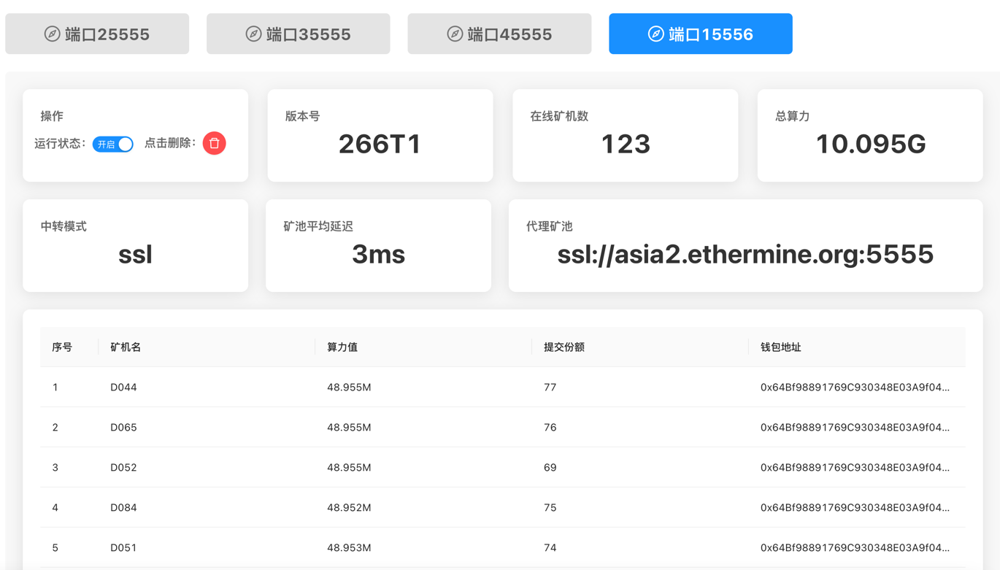

# minerProxy
矿工交流 TG电报群： https://t.me/MinerProxy_eth


解压缩后复制到服务器，运行minerProxy_web，然后用浏览器访问 “公网ip:18888”；密码默认:123456789  进入管理界面 

设置你的转发矿池/端口；可选择“不抽水”(自用) 或者“抽水”(分担服务器费用)；

支持LINUX，WINDOWS服务器，支持纯转发和自定抽水比例；包含自启动和进程守护；

还在被所谓的直连\中转IP抽水吗？自建转发；支持SSL加密；高并发，稳定一键搞定！


（如果遇到打不开管理界面，请开放服务器对应的端口）


# Liunx-手动安装
```bash
git clone https://github.com/mp-minerproxy/MinerProxy-eth.git 
cd MinerProxy-eth
chmod a+x minerProxy.linux
nohup ./minerProxy.linux & (后台运行，注意：& 也需要复制，运行完再敲几下回车)
tail -f nohup.out (后台运行时查看)
```


运行成功后访问 IP:18888 (如：127.0.0.1:18888 注意开放端口) 进行配置即可。 
```


### 后台运行时关闭

```bash
killall minerProxy.linux
```
### 后台运行时查看
```bash
tail -f nohup.out
```

