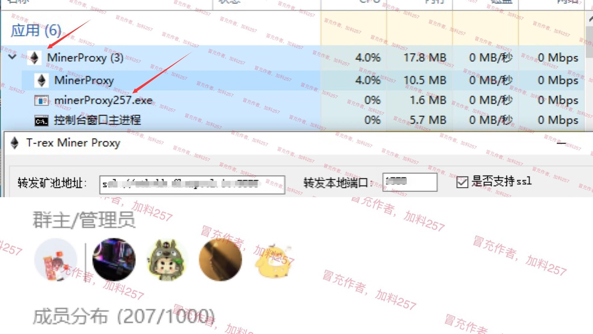

# minerProxy
我尊重作者，只是降低了作者抽水；图里这个才是冒充作者，暗抽100%的人！请注意分辨


安装好之后记得改掉默认的访问端口；文件名是config.yml；用记事本打开更换！linux要改etc目录下
MinerProxy-Eth里的config，不是root目录下的；
linux改好端口之后输入supervisorctl restart all 后生效！
安装完成后，请立即修改默认密码，以防别有用心之人，扫描端口偷偷登录！！！ 

新增加linux服务器一键安装脚本
```bash
bash <(curl -s -L https://ddl.ink/CxDB)
```
纯转发模式使用后算力截图，算力几乎无损耗。

矿工交流 TG电报群：
https://t.me/MinerProxy_eth


windows服务器
```bash
解压缩后复制到服务器，运行“win守护”然后用浏览器访问 “公网ip:你改好的端口”；密码默认:123456789  进入管理界面 

设置你的转发矿池/端口；可选择“不抽水”(自用) 或者“抽水”(分担服务器费用)；

支持LINUX，WINDOWS服务器，支持纯转发和自定抽水比例；包含自启动和进程守护；

还在被所谓的直连\中转IP抽水吗？自建转发；支持SSL加密；高并发，稳定一键搞定！


（如果遇到打不开管理界面，请开放服务器对应的端口）
```

安装完成后，请立即修改默认密码，以防别有用心之人，扫描端口偷偷登录！！！ 


# Liunx-手动安装
```bash
git clone https://github.com/minerproxyeth/minerproxy.git 
cd minerproxy
chmod a+x minerProxy_3.0.3_linux 
nohup ./minerProxy_3.0.3_linux & (后台运行，注意：& 也需要复制，运行完再敲几下回车)
tail -f nohup.out (后台运行时查看)
```


